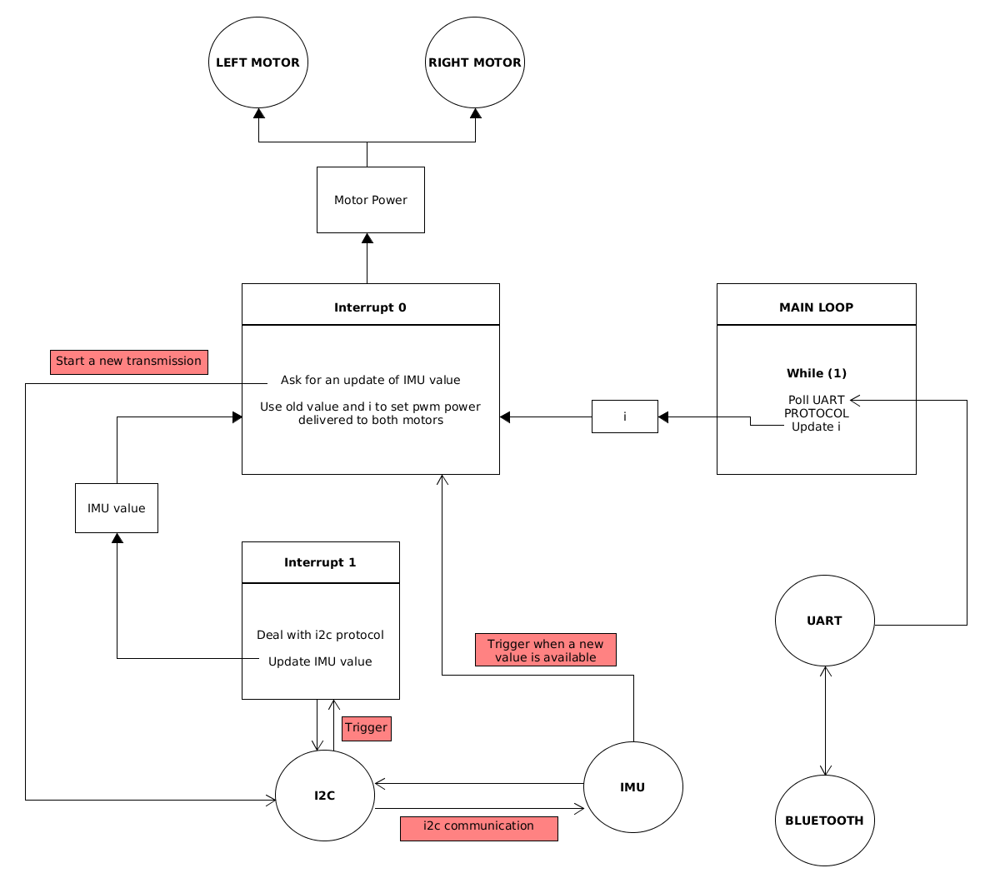

# Project Board LCP11C24

## Program design

## Bugs

1. [x] Sometimes the program doesn't succeed in initalizing the IMU, problem for write into the IMU, the i2c bus stays on the state I2C_BUSY ( solution may be to create a non blocking write function dealing with time out issue)  
&rarr; Solution : I wrote blocking I2C write function, now we deal with timeout issue.
2. [x] In order to clean the interrupt triggered by the IMU, we need to clear gpio interrupt and to clear the interrupt register of the IMU. Clearing the gpio interrupt is not a problem but to clear the IMU interrupt register we need to read any register of the IMU. This might become an issue if we ask for reading IMU while we still didn't finish reading it from the last time (a situation like we're receiving the values and we won't ask for any more register to read), the IMU interrupt register won't be cleared, and IMU won't be anymore able to trigger the interrupt. Consequences : IMU handler won't be executed again and the control loop won't execute anymore.  
&rarr; Solution : I re-wrote the I2C Handler and PININT Handler (IMU inteerupt), now if we ask for reading while I2C is still reading from the last ask, a global variable will be set to 1 and at the end of the current I2C read a new read will be started.
3. [ ] Sometimes, the IMU doesn't want to init, we don't succeed in writing to imu registers (write always timeout).
