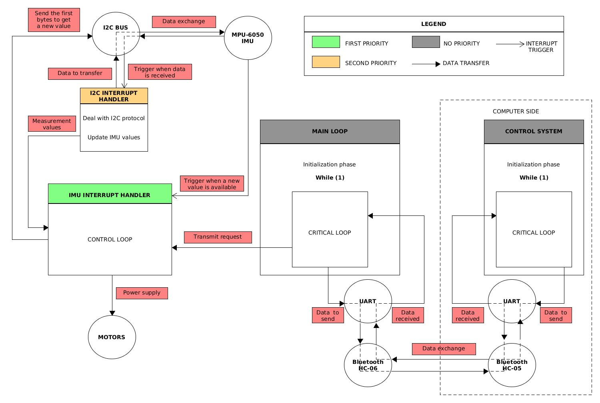
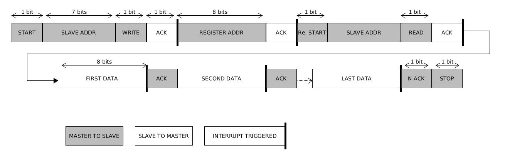

# Project Board LCP11C24

## Program design

## Control loop

Responsible of the balancing of the robot, you can find the source code in the interrupt_handler of the IMU in the file src/pinnint.c :
it takes the values measured by the IMU, calculate from them two different measurements of the current tilt angle of the robot (the angle given by the accelerometer of the IMU, the angle given by the gyrometer), use a complementary filter to combine both of them into a single measure of the angle. From this angle, we use PID controller to determine the power we should give to the motors to balance the robot. At the end of each loop (which is not really a loop, but as it's executed periodically we call this a loop), a new read of the IMU (MPU-6050) values is started (this read is then performed by the I2C interrupt handler which is less prioritary then the IMU interrupt handler).

## I2C protocol

## Critical loop

What we call critical loop is the instructions responsible of enable the secure communication between the robot and the control system (which is the computer in most cases I guess). This critical loop is executed in the main loop of the program and therefore is executed if the i2c interrupt or the IMU_interrupt are not triggered. 

## Files and folders

### UART interface (computer side)

In uart_interface_computer_side folder there are the files that implement the interface for communicating with the robot from your computer. To compile, juste run make, to start the programme : sudo ./interface_uart.out. In the program there are two different implementations, you can switch between them by defining CRYPT or REPLAY.  
  
REPLAY : Print all the bytes received as ASCII, you can use CTRL + Z to send a message, press enter to exit the handler. The reading is performed in the main loop while writing to the robot is done in the signal handler (of CTRL + Z).  

CRYPT : Receive a packet (14 bytes of messages + 2 bytes of nounce + 32 bytes of hash) of 48 bytes, extract the message, verify integrity and auth with the hash, nounce is here to prevent replay attacks. If the integrity and the auth is ok, then print the message. In order to communicate with the robot we compute a new 32-byte key at each session derivated from a 32-byte mother key, this is done in the handshake (so handshake need to be performed at each beginning of session). In order to do the handshake, just press CTRL + Z, then it will print handshake successful or handshake failed : errorNumber. If the handshake failed you don't need to reset the program in order to perform it again, just press CTRL + Z again. Sometimes when bluetooth disconnects and reconnects it can send some data through UART, we don't want this to disturb our communication, in order to fix this, I measure the time it takes to receive a packet (48 bytes or 80 bytes int he handshake), if we go over TIMEOUT_PACKET value, we forget what we received. So if bluetooth disconnects, wait few seconds that timeout is performed for the data sent by the bluetooth module (you can observe these data in REPLAY mode).

### Robot program

The files linked to the robot program are in the folders inc/ and src/, in order to compile and run, I used the IDE LPCXpresso that you can download on their website. See the program design to understund how the program works.

## Libraries

### UART interface (computer side)

This program use the libraries pthread (you can link it in the Makefile by putting -L pathToPthread after the -lpthread if it is not automatically found), serialport (same thing that for pthread if it's not automatically found, you can download it by running : sudo apt install libserialport-dev) and wolfssl library, I put the library in the folder so you don't need to download or do anything I guess).  

### Robot program

To configure your project as I did, you can right click on your project -> Properties -> C/C++ Build -> Settings -> Includes and set the paths : inc/, wolfssl/ (wherever it is on your computer, you can download the library on wolfssl website, configuration of the library is done in the file inc/wolfssl_user_setting.h), lpc_chip_cxx_lib/inc/ (which you can find on LPCXpresso website on the LPC11C24 page) and CMSIS_CORE_LPC11xx/inc (that is included in this github repository)

## Bugs

1. [x] Sometimes the program doesn't succeed in initalizing the IMU, problem for write into the IMU, the i2c bus stays on the state I2C_BUSY ( solution may be to create a non blocking write function dealing with time out issue)  
&rarr; Solution : I wrote blocking I2C write function, now we deal with timeout issue.
2. [x] In order to clean the interrupt triggered by the IMU, we need to clear gpio interrupt and to clear the interrupt register of the IMU. Clearing the gpio interrupt is not a problem but to clear the IMU interrupt register we need to read any register of the IMU. This might become an issue if we ask for reading IMU while we still didn't finish reading it from the last time (a situation like we're receiving the values and we won't ask for any more register to read), the IMU interrupt register won't be cleared, and IMU won't be anymore able to trigger the interrupt. Consequences : IMU handler won't be executed again and the control loop won't execute anymore.  
&rarr; Solution : I re-wrote the I2C Handler and PININT Handler (IMU interrupt), now if we ask for reading while I2C is still reading from the last ask, a global variable will be set to 1 and at the end of the current I2C read a new read will be started.
3. [x] Sometimes, the IMU doesn't want to init, we don't succeed in writing to imu registers (write always timeout).  
&rarr; Solution : While loop, we authorize 2 timeout and then we re-init all the components.

## Potential issues

1. [x] The prescale of the TIMERs acts directly to the motor performance. For example if I set a prescale of : 1 tick of the TIMER is 0.01 ms, with a loop size of 100 ticks -> a motor set to 1% power won't turn. But if I do the same thing with a prescale of : 1 tick is 1 ms, the wheel turns. So it could be interesting to see what prescale we choose : high prescale allows a better range for the motor power but the movement is more jerked.  
&rarr; Solution : 1600 timer ticks in 1 ms seems to be enough smooth.  